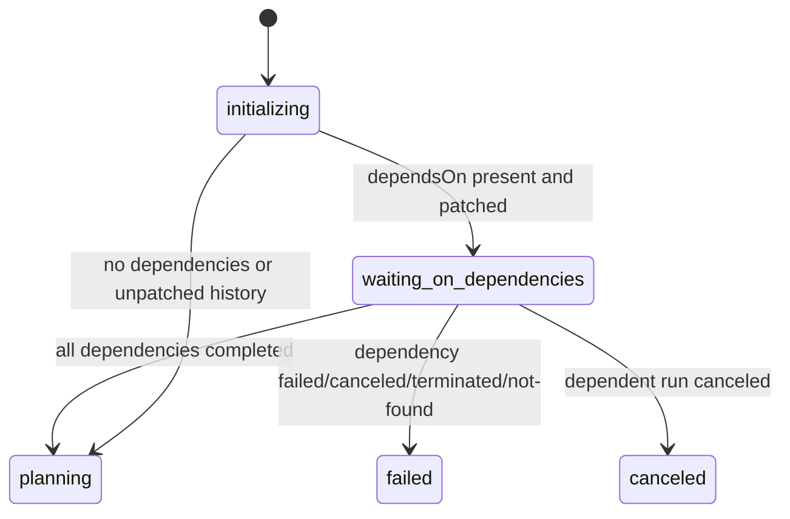

# Data Model: Task Dependencies Phase 2 - MoonMind.Run Dependency Gate

## Overview

Phase 2 does not introduce a new database entity. It extends the runtime state carried by `MoonMindRunWorkflow` while it enforces prerequisite execution dependencies before planning.

## Workflow-Local Fields

| Field | Type | Source | Purpose |
|------|------|--------|---------|
| `dependsOn` | `list[str]` | `initialParameters.task.dependsOn` | Declared prerequisite workflow IDs persisted during Phase 1 |
| `_state` | `str` | workflow lifecycle | Includes `waiting_on_dependencies` while blocked on prerequisites |
| `_waiting_reason` | `str | None` | workflow-local state | Set to `dependency_wait` while dependency gating is active |
| `_paused` | `bool` | workflow-local state | Existing operator pause flag that must still gate planning after dependencies resolve |
| `_cancel_requested` | `bool` | workflow-local state | Existing cancellation flag used to interrupt dependency waiting cleanly |

## Memo / Visibility Fields

| Field | Carrier | Value |
|------|---------|-------|
| `mm_state` | Search Attribute | `waiting_on_dependencies` while dependency wait is active |
| `waiting_reason` | Memo helper path | `dependency_wait` while dependency wait is active |
| `dependency_workflow_ids` | Memo | Declared dependency IDs for list/detail inspection |

## State Transitions

## Failure Model

| Failure input | Workflow outcome | Notes |
|--------------|------------------|-------|
| Dependency handle raises workflow failure | `failed` | Message should identify dependency failure cause |
| Dependency handle raises canceled/terminated style failure | `failed` | Dependency did not complete successfully |
| Dependent run canceled while waiting | `canceled` | Cancellation stops only the dependent run |
| Unpatched replay history | legacy path | Skip dependency gate to preserve existing workflow behavior |
